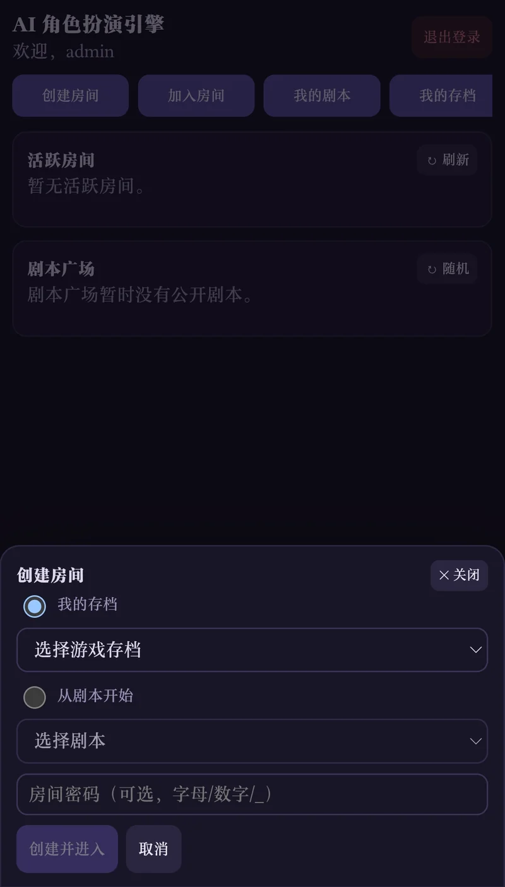
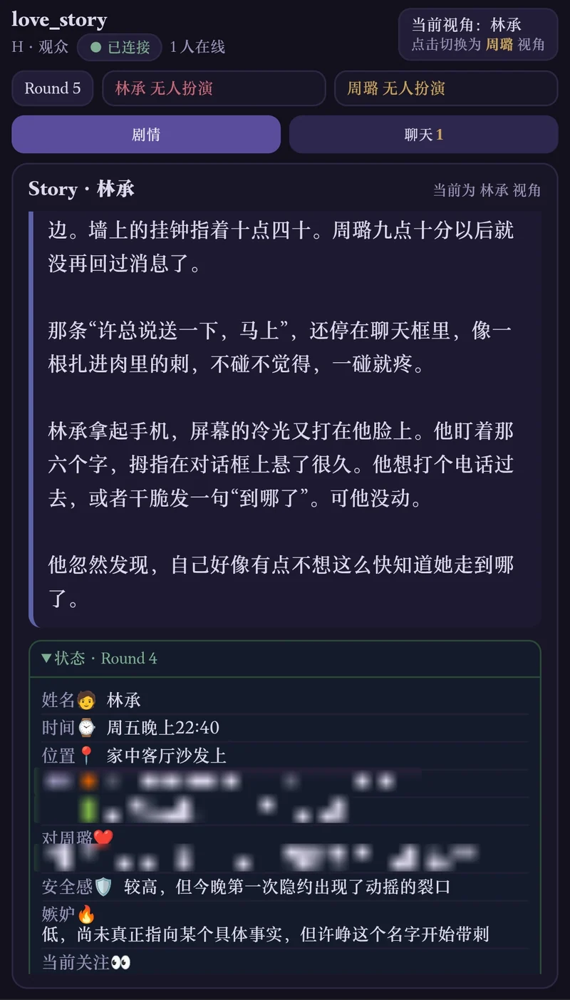
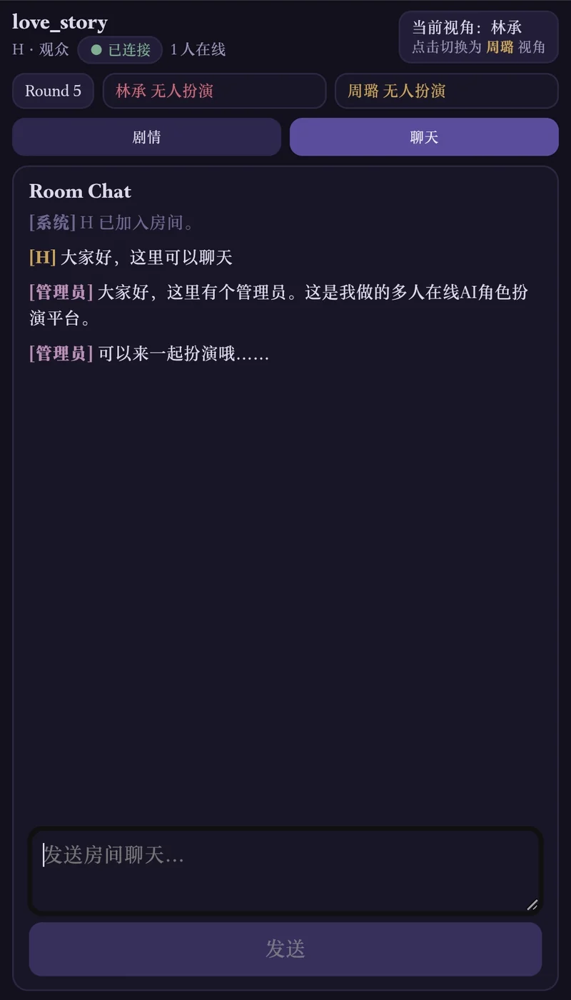
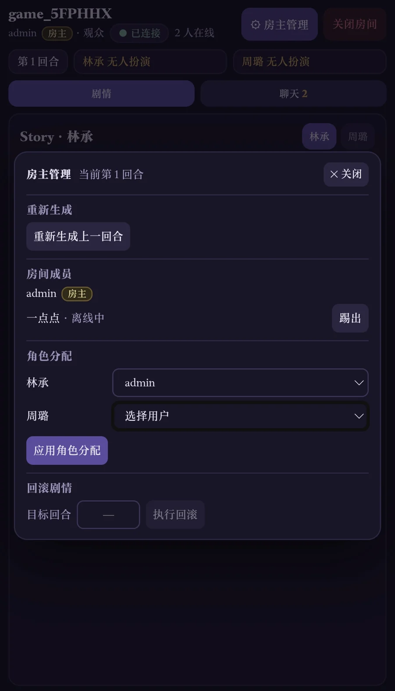

# AI RP Engine

<p align="center">
  English · <a href="./README.zh-CN.md">简体中文</a>
</p>

AI RP Engine is a lightweight, self-hosted multiplayer AI role-playing platform. Players join the same persistent story as different characters. The engine maintains a shared world state, then generates narration for each character from the information that character can know.

<p align="center">
  
  
  
</p>

<p align="center">
  <sub>Lobby · Character-specific story · Room chat</sub>
</p>

## Features

- **Multiplayer on the Web:** create or join rooms by code, optionally protect them with a password, assign character roles, and let spectators follow the story. Multiple rooms can run at once.
- **Persistent stories:** a Game Save survives room closure. Members can reconnect during the room's disconnect grace period; a reserved seat is not counted twice.
- **Dynamic characters:** the current deployment supports 2–4 roles. WorldUpdater advances one shared world and produces private character views and optional character status. Narrator writes a separate story for each role using only that role's information. Internal character views are not shown in the player story UI.
- **Separate room chat:** conversation and presence stay outside the AI story context and saved narrative history.
- **Authoring tools:** create and edit scripts in the basic Web Template Editor, or import and export complete Template ZIP files to work on advanced schemas and prompts locally.
- **Recovery and inspection:** the host can retry a failed AI round or roll back a single linear timeline. Game owners can export completed world states, actions, narration, views, and optional status as a JSON ZIP.
- **Self-hosted operation:** uses an OpenAI-compatible LLM endpoint, SQLite, and a local-only Admin console for platform management.

<p align="center">
  
</p>

<p align="center"><sub>Host controls</sub></p>

## How It Works

```text
User → Template → (snapshot) Game Save → (activated) Room → GameServer
```

A Template is reusable story content. Creating a Game Save copies its payload, so later Template edits do not change an existing game. A Room activates that save for live play; closing the Room keeps the save. Each active Room has its own GameServer runtime.

```text
Player actions
      ↓
WorldUpdater
      ↓
World state + character views / optional status
      ↓
Narrator × N
      ↓
Character-specific story
```

The world state is canonical. Each Narrator sees its character sheet, view, optional status, and bounded story history. Players see openings, actions, narration, and any enabled status bar; the generated character view remains an internal Narrator input.

## Quick Start

Python 3.11+ is required. The committed `web/dist/` serves the production client, so Node.js is not needed to run the platform.

```bash
pip install -r requirements.txt
cp .env.example .env
# Set LLM_API_KEY in .env to use the configured OpenAI-compatible endpoint.
python -m server.main
```

Open `http://127.0.0.1:8080/`, register and log in, then create a Room from an available Template or an existing Game Save. The host assigns roles in the Web interface. The platform can start without an LLM key, but creating or recovering a playable Room requires valid LLM configuration. Set `LLM_BASE_URL` and `LLM_MODEL` in `.env` to use another compatible provider.

The platform does not create an administrator automatically. After registering an account, grant it local administration access if needed:

```bash
python -m server.main --set-admin <username>
python client/admin.py
```

## Template System

`templates/default/` is the blank scaffold used to create new scripts. Its editable story fields start empty; simple world and character-view schemas and general AI prompts provide the underlying structure. `templates/default_en/` is its English showcase translation. `templates/example1/` contains a complete Chinese rock, paper, scissors scenario with match state and status bars, while `templates/example1_en/` is its English translation. The three showcases are not listed as playable Templates. A Template has `metadata.json` (`count`, `names`, `title`, `introduction`, `tags`), world text and state examples, numbered `characters/1..N/` directories, and AI prompts. Character status is optional. The `*_schema.json` files are field examples for the LLM, not standard JSON Schema.

The basic Web editor changes the title, introduction, tags, world text, character sheets, openings, and AI writing guidelines. It preserves advanced schemas and prompts. Download a Template ZIP to edit those files locally, then import the validated ZIP to create or replace your own Template. Older `players/` or `statusbar/` layouts are not automatically converted; see the [Platform guide](server/platform/README.md).

## Project Structure

| Path | Purpose |
| --- | --- |
| `server/platform/` | Accounts, Template/Game catalog, Rooms, Admin, and Web API |
| `server/gameserver/` | One game's rounds, state, protocol, persistence, and AI pipeline |
| `web/` | React and TypeScript client; `dist/` is the committed production build |
| `client/admin.py` | Loopback-only platform Admin console |
| `templates/default/` | Committed Template scaffold |
| `templates/default_en/`, `templates/example1/`, `templates/example1_en/` | English scaffold and Chinese/English scenario showcases; not playable catalog entries |
| `tests/` | Python tests and synthetic fixtures |

`data/`, `games/`, and Templates other than the four bundled directories contain local runtime or user data and are ignored by Git.

## Development

```bash
python -m unittest discover
cd web
npm ci
npx vitest run
npx tsc -b
npm run build
```

Rebuild and include `web/dist/` when changing Web source.

## Documentation

- [Platform guide](server/platform/README.md) — accounts, resources, Rooms, Web API, Admin, and imports.
- [GameServer guide](server/gameserver/README.md) — payload format, protocol, rounds, AI pipeline, retry, and recovery.
- [Developer and agent guide](AGENTS.md) — repository boundaries and editing rules.
- [Roadmap and decisions](TODO.md) — deferred work and design decisions.
- [简体中文 README](README.zh-CN.md).

## License

This project is licensed under the [MIT License](./LICENSE).
